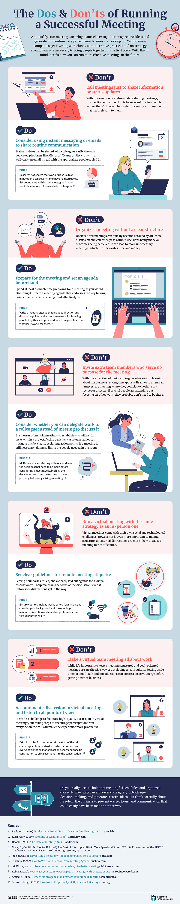

Imagine this: You're in a meeting room or Zoom call, listening to the discussion, but you can't help but glance at your mounting list of tasks. You're thinking about the code you could be debugging, the document you could be drafting, or the designs you could be reviewing. As the conversation continues to meander, going past the scheduled time limit, there's still a noticeable absence of concrete action items or documented decisions made, and as it concludes you are left with a lingering sense of ambiguity.

Sound familiar? It should. [According to a study by Atlassian](https://www.atlassian.com/time-wasting-at-work-infographic), the average employee attends 62 meetings a month and considers half of them as time wasted. In a modern corporate landscape, meetings have become the default mode of communication and decision-making. But do they always serve our best interests? Quite frequently, the answer is no. An over-reliance on meetings can lead to wasted hours, dwindling productivity, and an overarching sense of meeting fatigue.

## The Perils of Excessive Meetings

Meetings are an important part of any business. They bring teams together and foster collaboration. But, like anything, too much of a good thing can turn sour.

### Inefficiently invested time and energy

Each meeting consumes not just its allocated duration but also the preparation time and the time it takes for employees to switch their focus from their tasks to the meeting, and vice versa. Over time, these hours add up, and excessive meetings can become one of the biggest time-drainers for teams, leaving little time for actual work. With a significant chunk of the workday spent in meetings, employees often rush through their tasks to meet deadlines. This can lead to mistakes, oversight, and reduced quality of work.

Meetings require mental and emotional energy. Continuous or back-to-back meetings can leave employees feeling drained, leading to decreased productivity for the rest of the day. This is especially true for introverted team members who might find constant social interaction taxing. The phenomenon of [Zoom fatigue](https://en.wikipedia.org/wiki/Zoom_fatigue) during the pandemic is a glaring example of the physical and psychological toll of excessive meetings.

On the face of it, a one-hour meeting might seem innocuous. But when multiple team members are involved, the cumulative hours add up. For instance, a one-hour meeting with five team members equates to five work hours. When quantifying meetings in this manner it's imperative to ask if the return on this time investment is truly beneficial.

Every hour spent in a meeting is an hour not spent on other productive tasks. The time could have been utilized for strategic planning, research, execution of tasks, or even creative brainstorming. The lost opportunities can often far outweigh the tangible outcomes of the meeting, especially when it lacks sufficient planning.

### Decision Fatigue

With more meetings comes more decisions. Every decision, big or small, requires mental effort. Just as our physical muscles get tired with use, so does our brain's decision-making capacity. The constant need to make decisions during these meetings can lead to [decision fatigue](https://en.wikipedia.org/wiki/Decision_fatigue), where the quality of decisions deteriorates after a long session of decision-making.

### Groupthink mentality

An over-reliance on meetings can lead to a [groupthink](https://en.wikipedia.org/wiki/Groupthink) mentality, where unique perspectives are suppressed in favor of conformity. Groupthink is a phenomenon where the desire for group consensus overrides people's common sense desire to present alternatives, critique a position, or express an unpopular opinion. It often results in irrational decision-making outcomes. The urge to conform and the aversion to dissent can stifle innovation, limit diverse perspectives, and sometimes even lead to costly mistakes.

### Loss of valuable ideas

If nothing is being written down in a meeting, valuable ideas and decisions can be lost as soon as the meeting ends. Our memories are fallible, and without a written record, the details of the discussion may be misremembered or forgotten entirely. Effective meetings start with a clear agenda and conclude with documented decisions and action points.

### Reduced Autonomy

Constant meetings can make employees feel that they lack control over their workday. This can lead to decreased job satisfaction and a feeling of being micro-managed.

### Interrupts deep work

For roles that require concentration and deep thinking, such as programming, writing, or designing, interruptions from meetings can break their flow, significantly decreasing the quality and quantity of their work.

Consider the [Maker’s vs. Manager’s Schedule](http://www.paulgraham.com/makersschedule.html), an often referenced essay by Paul Graham (the co-founder of Y Combinator).

Makers thrive on large, undisturbed chunks of time, while managers operate on a schedule filled with hourly shifts in focus. The manager's schedule, segmented by hours, is great for supervisory roles. Switching tasks hourly doesn’t dent their productivity. But for 'makers' - individuals who create, innovate, and build - this structure is detrimental. A brief meeting can disrupt an entire day's momentum. A single meeting can fragment a maker's day, causing a cascading decline in productivity and morale. Trying to fit these distinct schedules together is where chaos ensues, with makers feeling their day being hijacked by sporadic interruptions.

Adding onto this, since most influential people within a company are typically on the manager's schedule, this can make it hard for makers to push back. It's essential for companies to recognize there are implicit power dynamics that often push makers to accept this fragmentation. 

## The Merits of a Written-First Culture

### Precision and clarity

The act of writing promotes reflection. When one has to put pen to paper (or fingers to keyboard), there’s a necessity to pause, think, and articulate. This invariably leads to more thorough and well-thought-out contributions. A written-first approach means important decisions and strategies are more clearly laid out, reducing potential misunderstandings and mitigating nuances that can be missed at a higher level view. This avoids the pitfalls of verbal communication where ambiguity might creep in. Clear writing reflects clear thinking. When there is an emphasis on clear writing, it means only well-structured and cogent ideas are propagated.

### Asynchronous

Writing is [asynchronous](https://about.gitlab.com/company/culture/all-remote/asynchronous/), which simply means exchanging information without the expectation of an immediate response. Asynchronous communication enables team members to process information more deeply, to work during their most productive hours, and to minimize interruptions.This can foster a sense of trust. When team members trust that they can catch up on and contribute to discussions in their own time, there’s less pressure to be constantly "plugged in" and more time for deep work and reflection. This uninterrupted focus time often ignites that creative spark that arises when one has the space to deeply contemplate and innovate in their work. By reducing the constant barrage of real-time demands, team members can do their best work.

In a world that's rapidly embracing remote work, this also ensures that team members across different time zones and geographies can engage with the content. This ensures that everyone, irrespective of their location or schedule, is included in crucial conversations.

### Reduced cognitive load

Meetings, while beneficial, can often overwhelm our cognitive capacities. By promoting a culture where significant conversations begin in written form, it allows team members to engage with content at their own pace, digesting and reflecting on the information before meetings. This ensures more productive discussions when meetings do occur.

### Level playing field

In the typical corporate setting, those with louder voices can overshadow discussions in meetings. However, adopting a written-first approach can change this dynamic. It creates a more flat structure where everyone has the chance to contribute. Such an approach ensures that all voices, not just the loudest, are valued and considered. This way, those who might hesitate to voice their opinions in a bustling meeting can still contribute their perspectives.

A written-first culture acts as a buffer against groupthink by providing an opportunity for individuals to process information, reflect, and articulate their thoughts without the immediate pressure of conforming to a dominant viewpoint prevalent in real-time group discussions.

Through writing, we can capture a broader spectrum of ideas and viewpoints, breaking down barriers that might exist due to position or personality type. Ultimately, a written-first method doesn't just only democratize the sharing of ideas; it enriches our collective understanding and creativity.

### Archival and reference

Written communication is clear, permanent, and accessible. It provides an accurate record that can be referred back to at any time, ensuring everyone is on the same page and accountability is maintained. Redundant verbal updates are eliminated. Information becomes more accessible and scalable. It becomes easier for teams to go back and understand the reasoning behind decisions, creating a valuable resource for onboarding new team members, reviewing strategies, and avoiding past mistakes.

Documents today aren't static; they are living entities that can be edited, updated, and expanded upon. This allows teams to continuously improve upon ideas. As new insights emerge or strategies pivot, the document can be updated to reflect these changes. Over time, what began as a simple draft can evolve into a comprehensive guide, enriched with contributions from various team members.

### Principled decision-making: Understanding the 'Why' Behind Decisions

Growth in a company is accompanied by an increase not just in the number of tasks and responsibilities, but also in the decisions that need to be made on a daily basis. As an organization scales, it's common to find more people involved in the decision-making process. While this multiplicity of perspectives can be an asset, it also brings in its wake the challenge of maintaining clarity and consistency.

Writing plays an integral role in ensuring principled decision-making within an organization. By documenting the thought processes, rationales, and reasons behind each decision, companies can ensure clarity, consistency, and alignment with their core values.

Often, decisions are communicated in terms of what needs to be done, with less emphasis on why it's being done. However, the rationale behind a decision can be just as important as the decision itself. Understanding the reasoning behind a decision is crucial for several reasons:

- **Alignment with Company Vision**: Each decision, no matter how small, should be a reflection of the company's overarching goals and values. By focusing on the principles guiding a decision, team members can ensure that their actions are consistently aligned with the broader company mission. As the dynamics of a company change with its growth, it's essential to anchor decision making in solid principles. This not only ensures sustainable success but also strengthens the core values and culture of the organization.

- **Learning and Adaptation**: When the reasoning behind a decision is clear, it's easier for teams to understand what went right or wrong, and why it did. This allows teams to evolve and adapt their strategies over time.

- **Promoting Ownership and Accountability**: Understanding the principles that influence a decision can lead to greater ownership of the outcomes. Team members are more likely to feel accountable for results when they grasp the core reasons for a particular course of action and feel involved in the decision making process.

## Examples of writing-first culture

The written-first culture can be exemplified best by companies that have not only embraced this approach internally but also made their documentation accessible to the wider public. Some notable examples are [Stripe](https://slab.com/blog/stripe-writing-culture/), [Amazon](https://slab.com/blog/jeff-bezos-writing-management-strategy/), [Basecamp](https://basecamp.com/guides/how-we-communicate), and [GitLab](https://slab.com/guides/how-success-is-written/gitlab-writing-offers-single-source-of-truth/).

Let's look at GitLab briefly. [Their extensive company handbook is publicly available online](https://about.gitlab.com/handbook/), and it exemplifies the depth of thought and commitment to a written-first ethos. With over 2,000 pages detailing everything from the company's vision and values to specific operational guidelines, it's a testament to the power of written documentation in ensuring clarity, alignment, and transparency. New employees can hit the ground running, having access to a reservoir of knowledge, while stakeholders and potential partners get an in-depth understanding of the company's ethos, strategies, and processes.

## Implementing a Writing-First Culture in Your Company

**Lead by Example**: Begin by incorporating a written-first approach in your personal communication. Instead of spontaneously calling for meetings, send detailed emails or memos outlining your thoughts. Encourage team members to spend time crafting well-thought-out written communication instead of hastily typed messages.

If a meeting is necessary, ensure it begins with a written agenda. Encourage team members to write down the main points they wish to discuss. This ensures everyone is prepared and can contribute effectively, reducing the need for follow-up meetings. Post-meeting, emphasize the importance of recording key decisions in writing.

**Establish Clear Guidelines**: Create a handbook or guidelines on when written communication is preferred over meetings. For example, updates, status checks, and sharing of routine information can be better served through written mediums.

**Tools and Resources**: Use collaborative document and knowledge sharing platforms (Notion, Jira) to foster this shift. There are also various tools available, like Grammarly or Hemingway App, that can assist writers in crafting clear and concise content. Encourage their use.

**Create templates**: Give teammates a starting point with sample docs, create templates that other teams can use as inspiration for their own documents.

**Allocate 'No Meeting' Days**: Designate specific days of the week as 'no meeting' days, allowing team members to focus solely on their tasks. This encourages them to communicate through written channels on these days.

**Celebrate Success**: Identify and champion team members who excel at written communication. By elevating and recognizing their expertise, they can naturally help guide and establish a robust infrastructure for a writing-first culture.

**Tracking, Review & Adapt**: Implement a system to track and analyze the number, duration, and outcomes of meetings. Tools like Microsoft Outlook's Insights or platforms like Time is Ltd. can provide data on how much time is spent in meetings. After a few months, gather feedback on the new approach. Understand any challenges faced by the team and address them.

Here are some other helpful tips to remember

**Use Plain Language**: Especially in corporate settings, there's a tendency to use complex terms or jargon. While some specific terms might be necessary, always ensure your intended audience understands them.

**Feedback Loops**: After drafting, seek feedback. Sometimes, what's clear to the writer might be ambiguous to the reader. Regular feedback helps identify and rectify such gaps.

**Regular Training**: Writing is a skill that can always be honed. Encourage your team to write down ideas before reaching for meetings. Regular workshops or training sessions on effective writing can elevate the quality of communication across the board.

**Open Dialogue**: Encourage an open dialogue about the transition. Some team members may be resistant to change or find it challenging. Address their concerns and offer solutions to make the shift smoother.

## The Art of Clear Communication: Writing With Purpose

When companies are inclined towards written communication, it's not enough to merely increase the volume of what's written; the quality of that writing is paramount. Clear, proficient, and effective writing reduces ambiguities, misinterpretations, and ensures that the message's intent and content are aligned.

#### [Grice's Maxims](https://en.wikipedia.org/wiki/Cooperative_principle)

Philosopher H.P. Grice articulated four conversational maxims that, while originally intended for spoken communication, are highly relevant to written discourse:

**Maxim of Quantity**: Provide the right amount of information – no more, no less. In writing, this means being concise. Avoid excessive jargon or verbosity. Share just the right amount of information – not too little that it leaves the reader in doubt, and not too much that it overwhelms or confuses them.

**Maxim of Quality**: Ensure that what you communicate is true and has evidence or basis. In corporate documentation or communication, base statements on data, research, or reliable sources. Refrain from making unfounded claims. All statements, especially in formal reports or communications, should be verifiable.

**Maxim of Relation (or Relevance)**: Only include information that is relevant to the conversation. Every piece of written content should have a clear purpose. This implies staying on topic. If you're drafting a report on quarterly sales, for instance, avoid veering into unrelated areas like a recent team-building event. Each sentence and paragraph should serve the document's primary objective.

**Maxim of Manner**: Structure is crucial. Be orderly and avoid obscurity or ambiguity. Structure your writing. Use headings, bullet points, and clear sentences. If there's a chance a statement can be interpreted in multiple ways, rephrase it to remove ambiguity.

When applied together, these maxims work synergistically to enhance communication. Adhering to them ensures that the information is not only precise but also trustworthy, relevant, and easy to understand. This reduces the chances of costly misunderstandings, streamlines operations, and fosters trust among stakeholders.

## Potential Drawbacks of a Written-First Culture – and How to Avoid Them

While there are undeniable advantages to a written-first culture, any strategy has its potential pitfalls. Here are some of the drawbacks associated with over-relying on written communication, and actionable advice to circumvent them:

#### Loss of Personal Connection

- Drawback: Written communication may lack the warmth and nuance of face-to-face conversations, making it challenging to foster deep personal relationships among team members.
- Solution: Schedule regular team bonding sessions or casual video calls where the focus is on relationship-building and not just task-oriented discussions. Encourage sharing personal stories, casual team lunches, or virtual coffee breaks.

#### Potential for Misinterpretation

- Drawback: Without vocal intonation and body language, written words can sometimes be misinterpreted, leading to confusion or unintended conflicts.
- Solution: Promote the use of clear, concise language. Encourage team members to seek clarifications when in doubt and foster an environment where it's okay to ask questions.

#### Overwhelming Amount of Written Content

- Drawback: With everyone documenting and sharing, there can be an information overload. This can make it hard for team members to sift through and find relevant details.
- Solution: Implement clear content structuring protocols. Use tagging, categorizing, and a hierarchical system to organize content. Periodically review and archive outdated materials.

#### Barrier for Non-Native English Speakers

- Drawback: In global teams, non-native English speakers might find it challenging to articulate complex ideas in writing compared to verbal communication.
- Solution: Offer language support or training sessions. Use platforms with real-time translation features or encourage team members to use translation tools when necessary. Foster a culture of patience and understanding.

#### Delay in Communication

- Drawback: While asynchronous communication has its merits, it can sometimes lead to delays, especially when quick decisions are needed.
- Solution: While the default is written, recognize when real-time communication, such as a quick call, is more efficient. Establish clear guidelines on when to opt for meetings versus written communication.

#### Over-reliance on Documentation

- Drawback: There might be situations where teams spend more time documenting than doing actual work or where documentation becomes so extensive that it's no longer practical.
- Solution: Encourage a balance. Documentation should aid the work, not become the work. Implement periodic reviews to ensure documentation is efficient and serves its intended purpose.

#### Lack of Immediate Feedback

- Drawback: Written communication often doesn't provide the immediate feedback that a face-to-face conversation does. Ideas might stagnate, and innovation could slow down.
- Solution: Establish a culture of prompt replies, especially on critical discussions. Incorporate tools that notify team members of crucial updates or comments.

## Finding the Balance

Meetings are essential for fostering personal connections, brainstorming new ideas, and discussing complex issues — but the key is to strike a balance. Use meetings judiciously and supplement them with robust written communication. If you must have meetings, be sure to include an agenda sufficiently beforehand so all participants can prepare properly and be sure the decisions made, including the reasoning why are clearly defined and documented by the end of the meeting.

In conclusion, shifting to a written-first culture can have significant benefits for your team's productivity and satisfaction. It’s time we reconsider the paradigm that equates meetings with progress, and explore ways of working in a more structured and methodical manner. As the future of work continues to evolve, isn't it time we reconsidered not just where we work, but how we communicate? 

To aid in remembering these concepts, you can save this helpful infographic summarizing the key points of running successful meetings.

